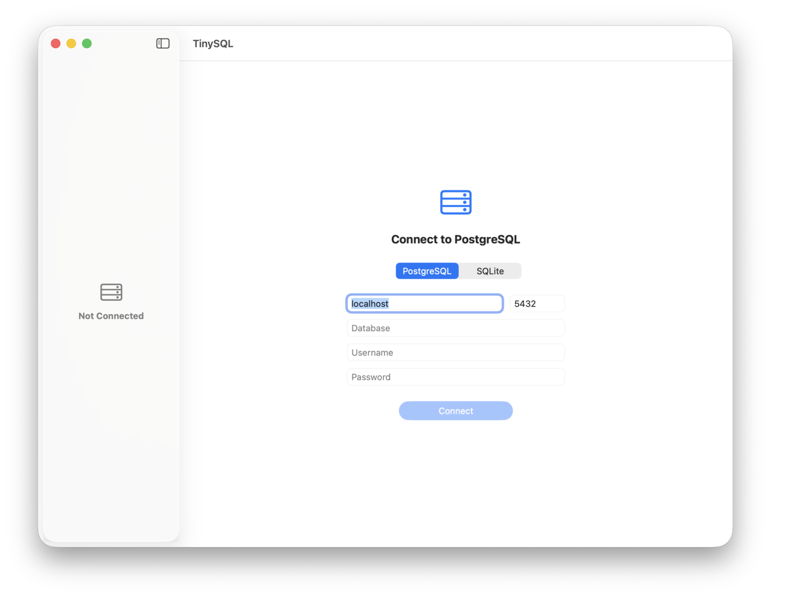

# TinySQL

A native macOS PostgreSQL browser. Pick a table, see its rows in a sortable grid. Pure Swift, zero dependencies, read-only by design.




## Features

- **Connect to PostgreSQL** — host, port, database, username, password
- **Table browser** — sidebar list of tables from your public schema
- **Sortable grid** — click columns to sort ascending or descending
- **NULL styling** — null values displayed with dimmed text
- **Pagination** — 100 rows per page for large tables
- **Query timing** — query time and row count in the status bar
- **Connection persistence** — remembers your last connection
- **Multiple connections** — switch between saved databases
- **Pure Swift** — no PostgreSQL drivers or C libraries required
- **On-device AI** — Cmd+K to ask questions about your data (CoreML, fully offline)
- **Light & dark mode** — follows system appearance

## Requirements

- macOS 26.0+
- Xcode 26+ (to build)

## Build

```bash
xcodegen generate --spec project.yml

xcodebuild clean build \
  -project TinySQL.xcodeproj \
  -scheme TinySQL \
  -configuration Release \
  -derivedDataPath /tmp/tinybuild/tinysql \
  CODE_SIGN_IDENTITY="-"

rm -rf /Applications/TinySQL.app
cp -R /tmp/tinybuild/tinysql/Build/Products/Release/TinySQL.app /Applications/
xattr -cr /Applications/TinySQL.app
```

## Keyboard Shortcuts

| Shortcut | Action |
|---|---|
| Cmd+N | New connection |
| Cmd+K | AI assistant |
| Cmd+Control+S | Toggle sidebar |

## Tech

Built with SwiftUI, [PostgresNIO](https://github.com/vapor/postgres-nio), and TinyKit.

## Part of [TinySuite](https://tinysuite.app)

Native macOS micro-tools that each do one thing well.

| App | What it does |
|-----|-------------|
| [TinyMark](https://github.com/michellzappa/tinymark) | Markdown editor with live preview |
| [TinyTask](https://github.com/michellzappa/tinytask) | Plain-text task manager |
| [TinyJSON](https://github.com/michellzappa/tinyjson) | JSON viewer with collapsible tree |
| [TinyCSV](https://github.com/michellzappa/tinycsv) | Lightweight CSV/TSV table viewer |
| [TinyPDF](https://github.com/michellzappa/tinypdf) | PDF text extractor with OCR |
| [TinyLog](https://github.com/michellzappa/tinylog) | Log viewer with level filtering |
| **TinySQL** | Native PostgreSQL browser |

## License

MIT
